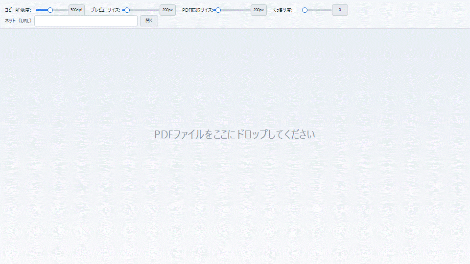
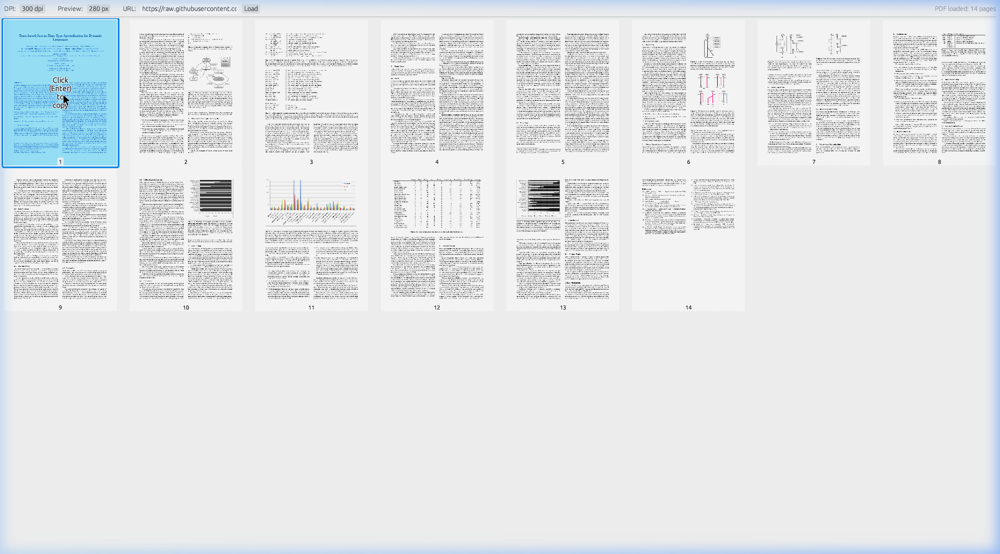

# PDF Page to Clipboard (Windows / macOS / Web)

<div align="center">
  
  <p><em>▲ 滑らかなサムネイル拡大・縮小と、ダブルクリックでの高品質クリップボード転送デモ</em></p>
</div>

PDFのページをサムネイル一覧で表示し、選択したページの画像を高品質でクリップボードにコピーする究極の生産性ツールです。
Windows/macOS向けネイティブデスクトップアプリとして動作するほか、WebAssembly (Wasm) を通じてモダンなWebブラウザ上でも動作する完全クロスプラットフォーム構成となっています。

## 💡 直感的な使い方 (3ステップ)

```
 [ PDFファイルの読み込み ] ──(ドラッグ＆ドロップ または URL入力)──> [ プレビュー調整 ] ──(ダブルクリック)──> [ 高品質で貼り付け! ]
```

<div align="center">
  
</div>

### 1. PDFを読み込む
- **ローカルファイル**: アプリケーション画面に PDF ファイルを直接**ドラッグ＆ドロップ**します。
- **オンラインファイル**: 画面上部の「ネット（URL）:」欄に Web 上の PDF の URL を入力し、「開く」ボタンまたは Enter キーを押します。読み込み中はボタンが「中止」に切り替わり、キャンセル後に遅れて戻った読み込み結果は安全に破棄されます。

### 2. プレビューと品質を調整する
- **コピー解像度**: 「コピー解像度:」スライダーで、クリップボードへコピーする画質（72〜600 DPI、標準300 DPI）を設定できます。
- **プレビューサイズ**: 「プレビューサイズ:」スライダーまたはピンチ操作で、画面上のサムネイル表示サイズ（80px〜モニタの縦解像度）を変更できます。拡大・縮小時は選択中のページが画面中央に来るように、行内の並びとスクロール位置を補正します。
- **PDF読取サイズ**: 「PDF読取サイズ:」スライダーで、サムネイル作成時に内部で保持する画像サイズ（80px〜モニタの縦解像度）を調整できます。変更時はPDFからサムネイルを再生成します。
- **くっきり度**: 「くっきり度:」スライダーでサムネイルのシャープネス（0.0〜1.5、標準0.0）を調整できます。デスクトップ版では保持済みの元画像から即時に再処理し、Web版ではメモリを抑えるためサムネイルを再生成します。
- **折り返しツールバー**: 画面幅が狭い場合、各スライダーやURL欄は操作単位ごとに自動で複数段へ折り返されます。
- **全画面表示**: 「全画面」ボタンでサムネイル表示を広く使えます。全画面中は上部ツールバーとステータス欄を隠し、「全画面解除」ボタンまたは Esc で戻れます。

### 3. 選択してクリップボードへ！
- コピーしたいページのサムネイルを**シングルクリックで選択**し、**ダブルクリック**（またはキーボードの矢印キーで選択して Enter / Space）でコピーします。
- **キビキビとした選択スクロール**: 矢印キー等によるサムネイルの選択移動時、スクロールアニメーションを省いて瞬時に位置を合わせることで、軽快かつダイレクトなレスポンス性を実現しています。
- 選択枠とコピー完了枠は一時的に表示され、1秒でフェードアウトします。閲覧中のページ内容を隠さない、軽いフィードバックにしています。
- 指定した高品質解像度の画像データが瞬時に生成され、システムのクリップボードに直接格納されます。そのまま Word や PowerPoint、Slack、メール等へ貼り付け（`Ctrl+V` / `Cmd+V`）できます。

---

## 🚀 主な機能

### PDF読み込み
- **ローカルPDFのドラッグ＆ドロップ**: デスクトップ版・Webアプリ版ともに、PDFファイルを画面へ直接ドロップして読み込めます。
- **URLからのPDF読み込み**: 画面上部の「ネット（URL）」欄からオンラインPDFを読み込めます。読み込み中は「中止」ボタンでキャンセルでき、遅れて戻った古い読み込み結果は破棄されます。
- **Webアプリ版のCORSフォールバック**: WebブラウザのCORS制限に備え、`codetabs`、`corsproxy.io`、`allorigins` の順にプロキシ取得を試行します。

### サムネイル表示と操作
- **一覧プレビュー**: PDFページをサムネイル一覧として表示し、目的のページを素早く探せます。
- **選択とコピー**: シングルクリックでページを選択し、ダブルクリックまたは Enter / Space でクリップボードへコピーします。
- **瞬時のスクロール追従**: キーボード等での選択サムネイル移動時、スクロールアニメーションによる遅延を排除し、瞬時に目的のページへジャンプさせることでダイレクトな操作感を提供します。
- **中央基準の拡大・縮小**: 「プレビューサイズ」スライダーまたはピンチ操作で表示サイズを80px〜モニタ縦解像度の範囲で動的に調整できます。列数が変わる場合も、選択ページが中央列に来るように先頭側へ空スロットを挿入して並びを補正します。
- **行ごとの中央寄せ**: 1行に並ぶサムネイル数が少ない場合でも、行全体の左右余白が均等になるように配置します。
- **軽い選択フィードバック**: 選択枠とコピー完了枠は1秒でフェードアウトし、ページ内容を隠す半透明オーバーレイは使いません。
- **全画面表示**: デスクトップ版・Webアプリ版ともに全画面表示に対応します。全画面中はツールバーとステータス欄を非表示にし、Esc または「全画面解除」ボタンで戻れます。
- **レスポンシブなツールバー**: 画面幅が狭い場合、各スライダーやURL欄は操作単位ごとに複数段へ折り返されます。

### 画質とパフォーマンス調整
- **コピー解像度**: クリップボードへコピーする画像の解像度を72〜600 DPIの範囲で調整できます。初期値は300 DPIです。
- **PDF読取サイズ**: サムネイル作成時に内部で保持する画像サイズを80px〜モニタ縦解像度の範囲で動的に調整できます。
- **くっきり度**: サムネイルのシャープネスを0.0〜1.5の範囲で調整できます。初期値は0.0です。
- **デスクトップ版**: PDF読取サイズは搭載メモリと空きメモリに応じて自動初期化されます。くっきり度の変更時は保持済みの元画像から即時に再処理します。
- **Webアプリ版**: ブラウザのメモリ情報を参考にPDF読取サイズを自動初期化します。くっきり度やPDF読取サイズの変更時は、メモリ消費を抑えるためサムネイルを再生成します。

### 大容量PDFへの安定性
- **世代管理による競合防止**: URL読み込み、ドラッグ＆ドロップ、サムネイル生成、コピー処理が重なっても、古い処理結果が新しいPDFを上書きしないように制御します。
- **Webアプリ版のPDF.js制御**: サムネイルレンダリングの同時実行数を環境に応じて制御し、レンダリングタイムアウト、ページリソース解放、PDF.jsのキャンセル処理を組み合わせています。
- **デスクトップ版の並列レンダリング**: CPUスレッド数を参考にサムネイル生成を並列化しつつ、コピー用の高解像度レンダリングとは独立して処理します。

### 文字表示とプラットフォーム対応
- **日本語UI**: OSやブラウザのロケールに応じて、日本語・英語の表示を切り替えます。
- **Webアプリ版の日本語フォント**: Noto Sans JP 400 Regularをバンドルし、Web版でも日本語UIが安定して表示されるようにしています。
- **Webアプリ版のPDFフォント補完**: PDF.jsにCMapと標準フォントデータを明示し、CIDフォントや一部の埋め込みフォントを含むPDFでも文字欠けが起きにくいようにしています。
- **ネイティブクリップボード連携**: デスクトップ版ではOSのネイティブAPI、Webアプリ版ではWeb標準のClipboard APIを使用して画像をコピーします。

## 💻 開発・ビルド方法

### 必要環境
- Rust 1.75以上（[rustup](https://rustup.rs/) で導入）
- WebAssemblyビルド用: `wasm32-unknown-unknown` ターゲットおよび [Trunk](https://trunkrs.dev/) ビルドツール

### 1. ネイティブデスクトップ版（Windows / macOS）の実行
WindowsではWin32クリップボードAPI、macOSでは`arboard`経由のネイティブクリップボードを使用します。

```bash
cargo run --release
```
- Windows: `target/release/PDFPageToClipboard.exe`
- macOS: `target/release/PDFPageToClipboard`

### 2. Webアプリ版（WebAssembly）の実行
PDF.jsによるハードウェア加速レンダリングとWeb標準のClipboard APIを利用します。

```bash
# Trunkが未インストールの場合は事前に導入してください
# cargo install trunk
# rustup target add wasm32-unknown-unknown

trunk serve
```
ローカル開発サーバーが起動し、ブラウザ（ `http://127.0.0.1:8080` ）上で即座に確認・テストが可能です。

## 🏛 ライセンス・リポジトリ

- **本体ソフトウェア**: MIT License
- **同梱フォント (Noto Sans JP 400 Regular)**: [SIL Open Font License 1.1 (OFL 1.1)](https://openfontlicense.org)
- **リポジトリ**: [https://github.com/science-education/pdf2clipboard](https://github.com/science-education/pdf2clipboard)
- **公開Web版**: [https://pdf2clipboard.pages.dev](https://pdf2clipboard.pages.dev)
