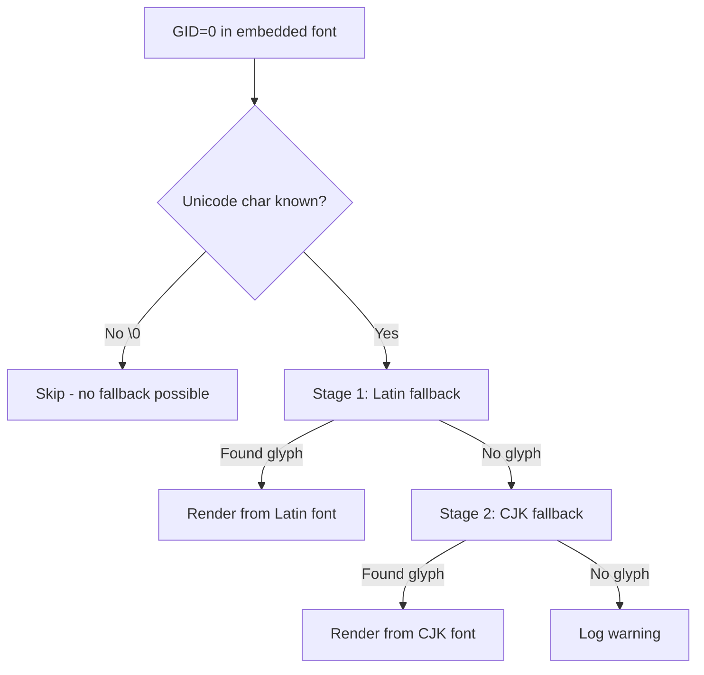

# 表示されない文字の根本修正 ウォークスルー

## 問題

PDFをレンダリングする際、多数の文字が表示されない問題が発生していた。

## 根本原因分析

MuPDF のフォント処理アーキテクチャと比較し、**3つの構造的欠陥**を特定した。

### 欠陥1: `render_cid_direct` にフォールバックなし（致命的）

埋め込みフォント（byte-indexed TrueType, CFF, CIDFont）で最も頻繁に使われるパスで、GID=0（notdef）のときに**何も描画せずスキップ**していた。

```rust
// 変更前: GID=0 の場合、静かにスキップ
if gid != 0 || char_at_pos.is_whitespace() {
    // 描画
}
// ← else がない → 文字が消える
```

### 欠陥2: `render_unicode_text` のフォールバックが排他的

CJK文字 → CJKフォントのみ、非CJK文字 → Latinフォントのみ。どちらかで見つからなくても、もう一方を試みなかった。

### 欠陥3: `is_cjk_or_kana` の範囲不足

一般句読点（—、…等）、数学記号、罫線文字、幾何学図形（■●▲）、囲み文字（①②③）等がカバーされていなかった。

---

## 変更内容

全て [text_rasterizer.rs](file:///c:/Users/user/pdf_copier_rs/pdf_oxide_local/src/rendering/text_rasterizer.rs) への変更。

render_diffs(file:///c:/Users/user/pdf_copier_rs/pdf_oxide_local/src/rendering/text_rasterizer.rs)

### 修正A: `render_cid_direct` にグリフ単位フォールバック追加

GID=0 かつ Unicode文字が判明している場合（`char_at_pos != '\0'`）、以下の段階的フォールバックを実行：

1. **Stage 1**: Latinフォールバック（Arial → TNR → Liberation Sans 等）
2. **Stage 2**: CJKフォールバック（Yu Gothic → Meiryo 等）
3. フォールバック不成功時はデバッグログを出力



### 修正B: `render_unicode_text` の順次フォールバック

排他分岐（CJK XOR Latin）を撤廃し、順次フォールバックに変更：

| 変更前 | 変更後 |
|--------|--------|
| `if !is_cjk → Latin only` | Stage 1: Latin（全文字） |
| `else if is_cjk → CJK only` | Stage 2: CJK（Latinで見つからなかった場合） |
| Latin失敗時CJK未試行 | 両方を順次試行 |

### 修正C: `is_cjk_or_kana` の範囲拡張

追加された Unicode ブロック（12ブロック）：

| 範囲 | 内容 | 代表文字 |
|------|------|---------|
| U+2000-206F | 一般句読点 | —、–、…、''、"" |
| U+2100-214F | 文字様記号 | ℃、№、℡ |
| U+2150-218F | 数字形式 | ⅰ、ⅱ、Ⅲ |
| U+2190-21FF | 矢印 | ←、→、↑、↓ |
| U+2200-22FF | 数学記号 | ≠、≤、±、∞ |
| U+2300-23FF | 技術記号 | ⌘ |
| U+2460-24FF | 囲み英数字 | ①、②、③ |
| U+2500-257F | 罫線 | ─、│、┌、┐ |
| U+2580-259F | ブロック要素 | █、▀ |
| U+25A0-25FF | 幾何学図形 | ■、●、▲、◆ |
| U+2600-26FF | 雑多記号 | ☆、♪、♠ |
| U+2700-27BF | Dingbats | ✓、✗ |

---

## 検証結果

- ✅ `cargo check` — エラー・警告なし
- ✅ `cargo build --release` — 成功（2m 02s）
- 📁 リリースバイナリ: `target/release/PDFPageCopier.exe`
